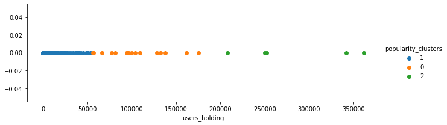
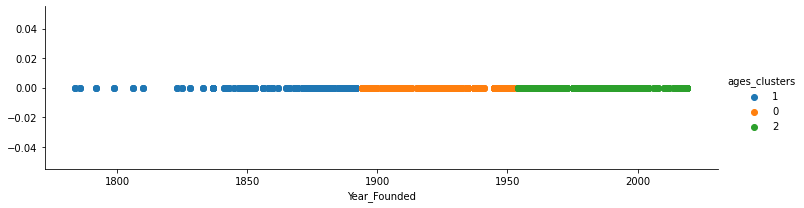

# Data transformation

In this Chapter we will go over the data transformations that we performed in order to combine the different data sources into one.

We performed the data cleaning in four Python notebooks that can be found under the `docs/data/preprocessing` folder. Here we will provide an overview of what we have done. Please take a look at the notebooks if you need further detail.

## Raw Data

In this section we will briefly describe how we transformed the raw data

### Robintrack data^[Code can be found in Notebook `docs/data/preprocessing/Robintrack.ipynb`]

As we mentioned in the Data Sources section, we got the number of users holding each company stock per day from Robintrack.

The Robintrack data came in a folder that contained a csv for each company ticker. We read each csv, selected the data for August 2018 - August 2020 and combined them to a dataframe with the following columns: `Date`, `Sybol`, `users_holding`.

### S&P500 stock prices and volume^[Code can be found in Notebook `docs/data/preprocessing/sp500.ipynb`)]
Furthermore, we got the daily Closing Price and the total Volume traded between August 2018 - August 2020  for each company by scraping yahoo finance.

More specifically, for each of the S&P500 tickers, we used the python package `pandas_datareader` to read those values from yahoo finance for the range of dates that we are interested in. We combined those dataframes and resulting in one large dataframe with the following columns: `Date`, `Sybol`, `Adj.Close` and `Volume`.

### VIX and Mcap
We got both Vix and Market cap from Bloomberg Terminal. For Market cap we had to select the tickers we are interested since the raw file contained other companies which are not included in the S&P500 list. The the volatility index was in ready-to-use format since it contained the index value by date.

### Company characteristics
We got both each companies characteristics from Bloomberg Terminal. Some characteristics that we are particularly interested in are `Industry` and `Year_Founded`.

### Combination of the above^[Code can be found in Notebook `docs/data/preprocessing/combine.ipynb`)]
We combined everything together in one dataframe. We performed an outer join on `Date` and `Symbol` which resulted in our final dataframe with the following columns: `Date`, `Sybol`, `users_holding`,`Adj.Close`, `Volume`, `Mcap`, `vix_Adj_close`. 

We also performed a few sanity checks such as making sure that we are only keeping the trading days between  August 2018 - August 2020 and that for each date we have all tickers.

## Further preprocessing

We decided further combine and preprocessing all of the different dataframes in Python.

### Clustering^[Code can be found in Notebook `docs/data/preprocessing/Results_preprocessing.ipynb`]

#### Clustering on `users_holding`

We measure a stock's popularity by averaging amount of user's holding across 2018-2020. Intuitively a company with a high average stock holding will be a popular company among Robintrack's users and vise verse.

We want to find a way to separate the companies into three popularity groups. One way to do this is to split the data evenly across three sections. However, in our case, a few companies attract users a lot more than others and if we were to follow this approach we would end up with groups that are very uneven in terms of scale.

In order to work around this issue,we assign each company to a popularity level by using K Means clustering(k=3) for the average user's holding over those 3 years. The three popularity categories are; `not_popular`(n=473), `normal`(n=16) and `very_popular`(n=5). Note that this clustering results to uneven clusters as we would expect. Bellow is a visualization of the clusters produced by python.

Therefore, we have defined the following popularity ranges:

* cluster **0**: `normal`(n=16)

* cluster **1**: `not_popular`(n=473)

* cluster **2**: `very_popular`(n=5)

#### Clustering on `Year_Founded`:

Following a similar line of thinking, we grouped the companies based on their Founded year. We wanted to avoid uneven groups in terms of founding years therefore we again used K Means clustering(k=3).

For each group we recorded the minimum and maximum founding rate and used that as the as group's label. More specifically the three founding ranges are;`1784-1892`(n=247),`1894-1952`(n=400), `1954-2019`(n=798). Bellow is a visualization of the clusters produced by python.

Therefore, we have defined the following founded ranges:

* cluster **0**: `1894-1952`(n=400)

* cluster **1**: `1784-1892`(n=247)

* cluster **2**: `1954-2019`(n=798)

## `Results` dataframes

### `data.csv`

-`Date`: date

-`Symbol`: a companies ticker

-`users_holding`: number of users holding that stock on that date

-`Adj.Close`: adjusted close price

-`Volume`: traded volume

-`Mcap`: market cap

-`vix_Adj_close`: vix; market index

-`Symbol_industry`: the industry of the company

-`popularity`: either of `not_popular`, `normal`, `very_popular`

### `cleveland.csv`

-`Year`: year

-`Symbol`: a companies ticker

-`avg_users_holding`: average number of users holding that stock on that year

### `mosaic.csv`

-`Symbol_industry`: the industry

-`founded_range`: the founding range as defined in the clustering section

-`popularity`: the popularity level as defined in the clustering section

-`freq`: how many times the above combination of values have appeared in the dataset
